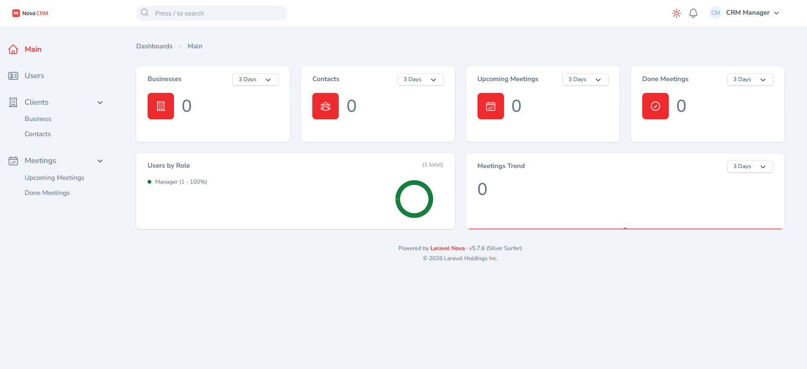

# NovaCRM

NovaCRM is a Laravel 12 + Nova 5 CRM application for managing businesses, contacts, and meetings with a 4-stage sales pipeline and activity tracking.



## Tech Stack

- **Backend:** Laravel 12, PHP 8.2+
- **Admin Panel:** Laravel Nova 5
- **Database:** SQLite (default) / MySQL
- **Frontend:** Tailwind CSS 4, Vite

## Features

- Role-based access control (Manager, Team Leader, Salesperson)
- 4-stage sales pipeline (Lead → Interested → Negotiation → Closed)
- Business and contact management
- Meeting scheduling with conflict detection
- Activity logging for pipeline changes and meetings
- CSV/Excel export with filter support
- Real-time notifications for expired meetings

## Prerequisites

- PHP 8.2 or higher
- Composer
- Node.js 18+ and npm

## Quick Start

### 1. Install dependencies

```bash
composer install
npm install
```

### 2. Create environment file

**Linux/macOS/Git Bash:**
```bash
cp .env.example .env
```

**Windows (CMD/PowerShell):**
```cmd
copy .env.example .env
```

Generate the application key:
```bash
php artisan key:generate
```

### 3. Create database and run migrations

**Linux/macOS/Git Bash:**
```bash
touch database/database.sqlite
```

**Windows (CMD):**
```cmd
type nul > database\database.sqlite
```

**Windows (PowerShell):**
```powershell
New-Item database\database.sqlite -ItemType File
```

Run migrations:
```bash
php artisan migrate
```

### 4. Link storage

Required for exports and file downloads.

```bash
php artisan storage:link
```

### 5. Run the application

```bash
composer run dev
```

Open http://localhost:8000 in your browser. Nova admin panel is at `/nova`.

## Seed Demo Data

```bash
php artisan db:seed
```

Creates demo users, a business, contact, and meeting.

### Demo Credentials

All users share password: `password`

| Email | Role |
|-------|------|
| `manager@example.com` | Manager |
| `teamleader@example.com` | Team Leader |
| `test@example.com` | Salesperson |

## Data Model

### Users

- **Roles:** Manager, Team Leader, Salesperson
- **Hierarchy:** Manager → Team Leader → Salesperson
- Managers have no supervisor
- Team Leaders report to Managers
- Salespersons report to Team Leaders

### Clients (Businesses)

- `business_name`, `address`
- `owner_id` - assigned user
- `pipeline_stage` - Lead, Interested, Negotiation, Closed
- `closing_result` - Won or Lost (when closed)

### Contacts

- Linked to a client
- `name`, `position`, `phone`, `email`

### Meetings

- Linked to client and contact
- `scheduled_at` - date/time
- `meeting_type` - Physical Visit, Phone Call, Online Meeting
- `purpose` - Presentation, Follow Up, Negotiation, Closing
- `result` - Successful, In Progress, Failed
- `unavailable_minutes` - blocks calendar for conflict detection

## Role Permissions

| Action | Manager | Team Leader | Salesperson |
|--------|---------|-------------|-------------|
| View all data | Yes | Own team | Own team |
| Create records | Yes | Yes | Yes |
| Edit records | All | Own team | Own team |
| Delete records | Yes | Own team | No |
| Manage users | Yes | No | No |

### Data Visibility

- **Manager:** Sees all data across all teams
- **Team Leader:** Own data + team members' data + manager's data
- **Salesperson:** Own data + teammates' data + team leader's + manager's data

## Pipeline

The sales pipeline has 4 stages:

1. **Lead** - Initial contact
2. **Interested** - Client shows interest
3. **Negotiation** - Active discussions
4. **Closed** - Deal won or lost

Moving to "Closed" requires:
- Selecting a closing result (Won/Lost)
- Adding a required comment

All pipeline changes are logged in the Pipeline Activity history.

## Meetings

### Scheduling

- Conflict detection prevents double-booking
- `unavailable_minutes` field blocks time after meeting starts
- Default block time is 60 minutes

### Results

- **In Progress** - Default for upcoming meetings
- **Successful** - Meeting achieved its goal
- **Failed** - Meeting did not achieve its goal

### Notifications

Salespersons receive notifications when:
- Their meetings expire (past scheduled time)
- Team Leader assigns them a meeting

Team Leaders receive notifications when:
- Their team members create meetings

## Exports

CSV/Excel exports are available from the Actions dropdown on:
- Businesses
- Contacts
- Upcoming Meetings
- Done Meetings

**To export filtered data:**
1. Apply your filters
2. Click "Select All Matching"
3. Choose "Export to Excel" from Actions

## Activity Logs

### Pipeline Activity

Tracks all pipeline changes:
- Stage transitions
- Closing result updates
- Comments and timestamps
- Actor (who made the change)

### Meeting Activity

Tracks meeting updates:
- Rescheduling
- Result changes
- Timestamps and actors

## Environment Configuration

Key `.env` settings:

| Variable | Description |
|----------|-------------|
| `APP_URL` | Must match browser URL |
| `DB_CONNECTION` | `sqlite` (default) or `mysql` |
| `NOVA_LICENSE_KEY` | Required for non-localhost domains |
| `QUEUE_CONNECTION` | `database` for async jobs |

## Running on LAN

To access from other devices on your network:

1. Update `.env`:
```
APP_URL=http://192.168.1.20:8000
```

2. Start servers:
```bash
php artisan serve --host=0.0.0.0 --port=8000
npm run dev -- --host
```

3. Access via `http://YOUR_IP:8000`

## Testing

```bash
php artisan test
```

## Troubleshooting

### Assets not updating
```bash
npm run build
```

### Vite manifest error
```bash
npm run build
```

### Exports not downloading
1. Verify `php artisan storage:link` was run
2. Check `APP_URL` matches browser URL

## Project Structure

```
app/
├── Enums/          # UserRole, PipelineStage, MeetingType, etc.
├── Models/         # User, Client, Contact, Meeting
├── Nova/           # Nova resources and actions
├── Policies/       # Access control policies
└── Notifications/  # Meeting notifications

database/
├── migrations/     # Database schema
├── factories/      # Test factories
└── seeders/        # Demo data seeders

public/
├── css/            # Custom Nova styles
└── js/             # Custom Nova scripts
```

## License

This project uses Laravel Nova which requires a valid license for production use.
